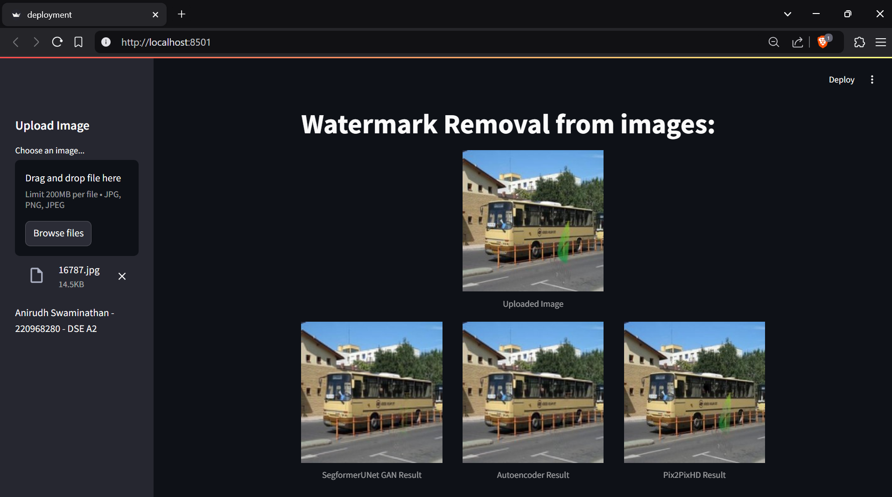
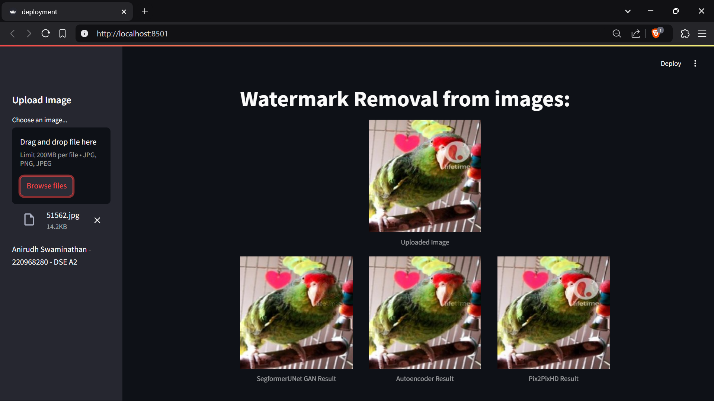
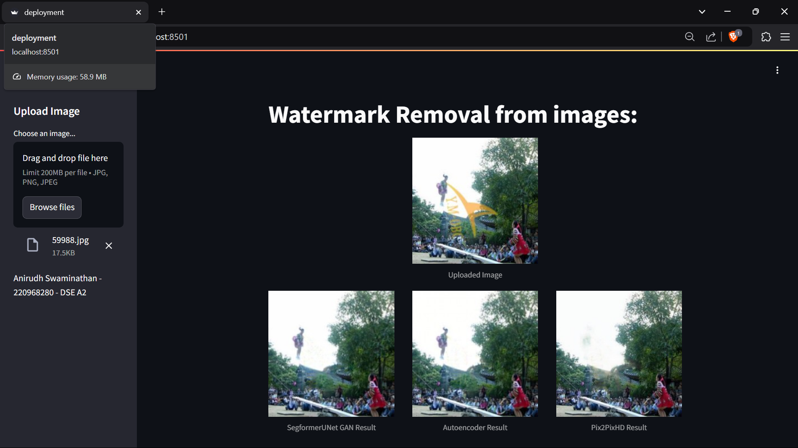

# Watermark Removal using GANs

## Overview
This project explores watermark removal from images using Generative Adversarial Networks (GANs). The primary objective is to generate watermark-free images while preserving the original image quality. Several models were tested, with the best-performing architecture being a **SegformerUNet GAN**, leveraging a **Segformer encoder** and a **UNet decoder**.

## Dataset
**CLWD dataset** (Colored Large-Scale Watermark Dataset) by Yang Liu, Zhen Zhu, and Xiang Bai:
- 200 colored watermarks
- 60,000 total images
  - 50,000 for training
  - 10,000 for validation
- 10,000 images for testing

## Project Pipeline
1. **Data Preprocessing**: Convert dataset into a format suitable for model input.
2. **Model Selection & Definition**:
   - **Generator**: Segformer encoder + UNet decoder
   - **Discriminator**: 70x70 PatchGAN
3. **Training & Validation**:
   - Train using adversarial, reconstruction (L1), and perceptual (VGG19) losses.
   - Hyperparameter tuning.
4. **Testing & Evaluation**:
   - Compare different architectures.
5. **Deployment**: Finalize best-performing model.

## Shortlisted Models
- **Pix2Pix**: Conditional GAN for image-to-image translation (prone to blurriness in high-resolution images).
- **Pix2PixHD**: Multi-scale architecture for better high-resolution feature learning (longer training time).
- **Deep Image Prior**: CNN-based feature extraction, works well on single images (risk of overfitting, struggles with complex watermarks).
- **Advanced UNet**: Skip connections maintain original features, struggles with non-patterned watermarks.

Based on evaluation, **Pix2PixHD** was initially selected but later replaced by **SegformerUNet GAN** due to better qualitative performance.

## Implementation Details
### Model Architecture
#### Generator: **Segformer encoder + UNet decoder**
- **Pretrained Segformer Mit-B5** encoder
- **UNet-style decoder**
#### Discriminator: **70x70 PatchGAN**

### Loss Functions
- **Adversarial Loss**: Binary Cross-Entropy
- **Reconstruction Loss**: L1 Loss
- **Perceptual Loss**: Pretrained VGG19

### Metrics
- **PSNR (Peak Signal-to-Noise Ratio)**: Targeting **>30 dB**
- **SSIM (Structural Similarity Index)**: Targeting **>0.85**

### Hyperparameters
| Parameter | Value |
|-----------|-------|
| Learning Rate | 2e-4 |
| Batch Size | 32 |
| Epochs | 50 |
| Beta1 | 0.9 |

### Model Parameters
| Model | Generator Parameters | Discriminator Parameters |
|--------|----------------------|--------------------------|
| SegformerUNet GAN | 82,345,475 | 1,557,313 |
| Autoencoder | 82,345,475 | - |
| Pix2PixHD GAN | 184,123,715 | 1,557,313 |

## Results
| Model | Average SSIM | Average PSNR |
|--------|-------------|--------------|
| **SegformerUNet GAN** | 0.81507 | 27.87968 |
| **Autoencoder** | 0.81917 | 27.93482 |
| **Pix2PixHD GAN** | 0.94623 | 30.16776 |

Despite **Pix2PixHD** showing the best numerical metrics, **SegformerUNet GAN** demonstrated better qualitative results in removing watermarks.

## Challenges & Optimizations
- **Compute limitations**: Originally planned to handle varying image sizes using patch-based processing but switched to **256x256 fixed-size training**.
- **Gradient Penalty**: Implemented in the discriminator.
- **Gradient Freezing**: Disabled generator updates during discriminator training and vice versa.

## Future Improvements
- Experiment with different **Vision Transformers** for encoding.
- Integrate aspects of **Pix2PixHD** for finer detail reconstruction.

## Deployment images
Here are some sample images showcasing the performance of different models:

## References
- **Segformer Model**: [Hugging Face](https://huggingface.co/docs/transformers/en/model_doc/segformer)
- **CLWD Dataset Paper**: [arXiv](https://arxiv.org/pdf/2012.07616)
- **Pix2PixHD cGAN Paper**: [arXiv](https://arxiv.org/pdf/1711.11585)
- **Deep Image Prior Paper**: [Dmitry Ulyanov](https://dmitryulyanov.github.io/deep_image_prior)
- **Pix2Pix cGAN Paper**: [arXiv](https://arxiv.org/abs/1611.07004)
- **Advanced UNet for Watermark Removal**: [arXiv](https://arxiv.org/pdf/2302.11338)
- **Gradient Penalty Implementation**: [WGAN-GP](https://towardsdatascience.com/demystified-wasserstein-gan-with-gradient-penalty-ba5e9b905ead)

## Repository Links
- **GitHub**: [hyperiqn/nowatermark](https://github.com/hyperiqn/nowatermark)
- **Google Drive Dataset**: [CLWD Dataset](https://drive.google.com/file/d/17y1gkUhIV6rZJg1gMG-gzVMnH27fm4Ij/view)

## Acknowledgments
Special thanks to the authors of the CLWD dataset and the researchers behind Pix2PixHD, Segformer, and advanced UNet architectures.

---

